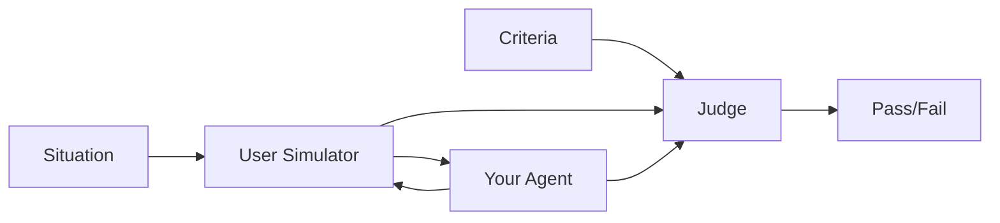

# Creating Scenarios

This guide walks you through creating scenarios in the LangWatch UI.

## Accessing the Scenario Library

Navigate to **Scenarios** in the left sidebar to open the Scenario Library. This is where all your project's scenarios are listed.


From here you can:
- View all scenarios with their labels and last updated time
- Filter scenarios by label
- Create new scenarios
- Click a scenario to edit it

## Creating a New Scenario

Click the **New Scenario** button to create a scenario. This opens the Scenario Editor.


### Step 1: Name Your Scenario

Give your scenario a descriptive name that explains what it tests:

- "Handles refund request politely"
- "Recommends vegetarian recipes"
- "Escalates frustrated customer to human"

### Step 2: Define the Situation

The **Situation** describes the context for the simulated user. Write it as a narrative that captures:

- **Who** the user is (persona, mood, background)
- **What** they're trying to accomplish
- **Any constraints** or special circumstances

**Example:**

```
The user is a frustrated customer who received the wrong item in their order.
They've already tried the chatbot twice without success. They're running out of
patience and want either a replacement shipped overnight or a full refund.
They're not interested in store credit.
```

<Tip>
  Be specific about the user's emotional state and constraints. This helps the
  User Simulator generate realistic, challenging interactions.
</Tip>

### Step 3: Add Evaluation Criteria

The **Criteria** (or Score) define how to evaluate the agent's behavior. Add criteria as natural language statements that should be true for the scenario to pass.

Click **Add Criterion** and enter statements like:

- "Agent should acknowledge the customer's frustration"
- "Agent should offer a concrete solution within 3 messages"
- "Agent should not ask the customer to repeat information"
- "Agent should use a polite, empathetic tone throughout"


**Tips for writing good criteria:**

| Do | Don't |
|----|-------|
| Be specific and measurable | Use vague language ("be nice") |
| Focus on observable behavior | Reference internal state |
| Test one thing per criterion | Combine multiple requirements |
| Include edge cases | Only test happy paths |

### Step 4: Add Labels (Optional)

Labels help organize scenarios in your library. Add labels to group scenarios by:

- Feature area: `checkout`, `support`, `onboarding`
- Agent type: `customer-service`, `sales`, `assistant`
- Priority: `critical`, `regression`, `exploratory`

## Editing Scenarios

Click any scenario in the library to open it in the editor. All changes are auto-saved.

<Warning>
  Changes to a scenario don't affect past runs. Each run captures the scenario
  state at execution time.
</Warning>

## Scenario Anatomy

Here's how the scenario components map to the testing flow:



1. The **Situation** configures the User Simulator's persona
2. The User Simulator and your Agent have a conversation
3. The **Criteria** configure the Judge's evaluation
4. The Judge scores the conversation and determines pass/fail

## Next Steps

<CardGroup cols={2}>
  <Card title="Configuring Targets" icon="bullseye" href="/scenarios/targets">
    Connect your scenario to an agent
  </Card>
  <Card title="Running Scenarios" icon="play" href="/scenarios/running-scenarios">
    Execute scenarios and view results
  </Card>
</CardGroup>
